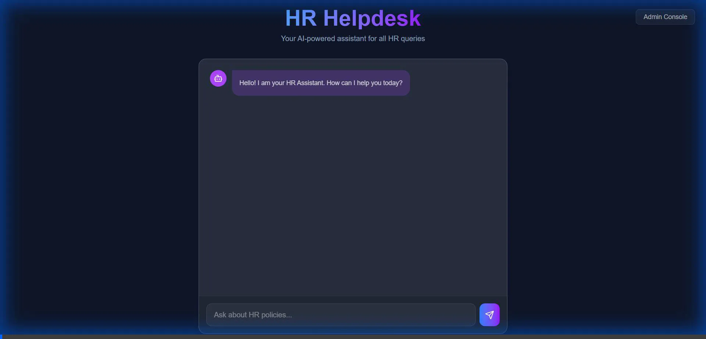

# HR Helpdesk (RAG App)

An intelligent, RAG-based (Retrieval-Augmented Generation) HR Helpdesk application designed to answer employee queries about company policies instantly and accurately.



## 🚀 Executive Summary: Built with Antigravity
This solution was architected and implemented using **Antigravity**, Google's advanced agentic AI coding assistant. Leveraging autonomous capabilities, Antigravity handled the end-to-end development lifecycle:
*   **Rapid Prototyping**: Instantly scaffolded a production-ready Full Stack (Next.js + FastAPI) architecture.
*   **Complex Problem Solving**: Autonomously diagnosed and resolved system-level issues, including Python environment conflicts and IPv6 networking constraints.
*   **Agentic Verification**: Deployed autonomous browser subagents to verify user flows, record demos, and ensure a bug-free experience before deployment.

## 💡 Usage

Experience the seamless interaction flow:
1.  **Upload**: Admins upload PDF policy documents via the **Admin Console**.
2.  **Ask**: Employees ask natural language questions in the **Chat Interface**.
3.  **Answer**: The AI retrieves relevant policy sections and provides precise answers.


## ✨ Features

*   **🤖 AI-Powered Chat**: Uses Gemini 2.5 Flash to answer questions based *only* on your verified HR documents (RAG).
*   **📂 Admin Console**: Easy-to-use interface for HR administrators to upload and manage policy PDFs.
*   **🧠 vector Search**: Powered by ChromaDB for semantic search and retrieval of relevant document chunks.
*   **⚡ Modern Stack**: Built with FastAPI (Python) for high-performance backend and Next.js (TypeScript) for a responsive frontend.
*   **🔌 Extensible**: Designed with a modular architecture to easily swap LLMs or vector stores.

## 🛠️ Tech Stack

*   **Frontend**: Next.js 16, Tailwind CSS, Lucide React
*   **Backend**: FastAPI, Uvicorn, Python 3.11
*   **AI & ML**: Google Gemini API, LangChain, SentenceTransformers
*   **Database**: ChromaDB (Vector Store)

## 🏗️ Architecture

1.  **Ingestion**: Admin uploads PDFs -> Text extracted -> Split into chunks -> Embeddings generated (all-MiniLM-L6-v2) -> Stored in ChromaDB.
2.  **Retrieval**: User asks question -> Query embedding -> Similarity search in ChromaDB -> Top k chunks retrieved.
3.  **Generation**: Retrieved chunks + User Query -> Gemini LLM -> Precise Answer.

## 📦 Installation

### Prerequisites
*   Python 3.11+
*   Node.js 18+
*   Google Gemini API Key

### 1. Backend Setup

```bash
cd backend

# Create virtual environment
python -m venv venv
# Windows:
.\venv\Scripts\activate
# Mac/Linux:
# source venv/bin/activate

# Install dependencies
pip install -r requirements.txt

# Configure Environment
cp .env.example .env
# Open .env and add your GOOGLE_API_KEY
```

### 2. Frontend Setup

```bash
cd frontend

# Install dependencies
npm install

# Configure Environment
cp .env.local.example .env.local
```

## 🏃‍♂️ Running the App

**Start Backend:**
```bash
cd backend
python -m uvicorn main:app --reload --host 0.0.0.0 --port 8000
```
*Backend runs at: http://localhost:8000*

**Start Frontend:**
```bash
cd frontend
npm run dev
```
*Frontend runs at: http://localhost:3000*

## 📜 License

MIT
